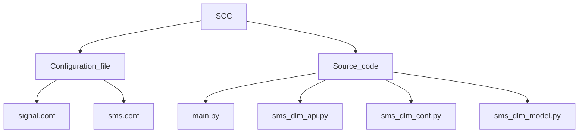

# Signal_Managing_System_Module

```mermaid
graph TD;
    SCC-->Configuration_file;
    SCC-->Source_code;
    Configuration_file-->signal.conf;
    Configuration_file-->sms.conf;
    Source_code-->main.py;
    Source_code-->sms_dlm_api.py;
    Source_code-->sms_dlm_conf.py;
    Source_code-->sms_dlm_model.py;
```
