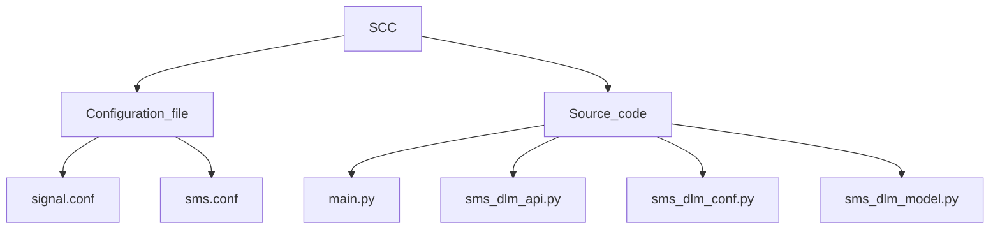

# Signal_Managing_System_Module

# [Configuration File](https://github.com/paragnema1/Siding_Control_Centre_Module/tree/main/Configuration_Files) - Files/settings that a program reads before startup.

### [signal.conf](https://github.com/paragnema1/Siding_Control_Centre_Module/blob/main/Configuration_Files/scc.conf) 
    "signal_id" : A unique identifier for each signal in the network,
    "section_marks": An array of objects containing section marks
                    ["section_mark_id":A unique identifier for the section mark.,
                    "sections":Array of Sections,
                    "sections_name":Array of Section name,
                    "sections_controlled":Array of sections controlled,
                    "signal_controlled":Array of signal controlled,
                    "next_signal_id":signal_id of next signal.]
                    
### [sms.conf](https://github.com/paragnema1/Siding_Control_Centre_Module/blob/main/Configuration_Files/section.conf) - sms configuration file contains:-

    Comment- Description of file.
    Version - version of module.
    SSC_ID - SSC Identifier.
    Database - Object Containing database of provider, User, Password, HOST Protocol, HOST IP address, Database name
    Local MQTT Broker - Object Containing database of MQTT broker, Broker IP address, Username, Password, Port no. of the broker.
    
# [Source Code File](https://github.com/paragnema1/Siding_Control_Centre_Module/tree/main/Source_Code) - Directory containing sub-modules.
### [insert_conf.py](https://github.com/paragnema1/Siding_Control_Centre_Module/tree/main/Source_Code/Insert_Confuguration_File) - A module containing functions to convert (JSON files to Python) and (Python to JSON).
	Class SectonConfig:
	
	def read_cfg(self, file_name): function to convert JSON file to Python file.
	
	def print_cfg(self): function to convert Python file to JSON file.

### [insert_yard_conf.py](https://github.com/paragnema1/Siding_Control_Centre_Module/tree/main/Source_Code/Insert_yard_configuration) - A module containing functions to convert (JSON file to Python) and (python to JSON).
	Class SectonConfig:
	
	def read_cfg(self, file_name): function to convert JSON file to Python file.
	
	def print_cfg(self): function to convert Python file to JSON file.

### [sms_dlm_model.py](https://github.com/paragnema1/Siding_Control_Centre_Module/tree/main/Source_Code/SCC_DLM_MODEL) - Module to create tables in the database. 
	We have created tables for pms_config and signal_playback.

### [scc_layout_model.py](https://github.com/paragnema1/Siding_Control_Centre_Module/tree/main/Source_Code/SCC_LAYOUT_MODEL) - Module to create tables in the database.
	We have created tables for LayoutSectionInfo, and LayoutSectionConnectionsInfo.

### [scc_trail_through.py](https://github.com/paragnema1/Siding_Control_Centre_Module/tree/main/Source_Code/SCC_TRAIL_THROUGH) - module to detect trail through and torpedo status.
	***Class Sec:*** - Initialised Section Variables.
	
	***Class Trailthrough:***
	**def get_point_config(self):** - function to return section_id and
	point_id from PointConfig table.
	
	**def init_trail_through_info(self):** - add records on tt_sec_obj_list ['section_id and point_id by calling get_point_config' & 'section config objects by calling scc_api.read_section_connections_info() function.
	
	**def detect_trail_through(self, section_json_data, point_obj_list):** - function to detect trail through using passed section_json_data and point_obj_list.
	
	**def find_torpedo_status(self, section_json_data):** - finding torpedo status by using objects of tt_sec_obj_list.
	
	**def construct_section_json_msg(self):** - return json_msg with key1 as "timestamp" & key2 as (object of tt_section_msg_list).

### [sms_dlm_conf.py](https://github.com/paragnema1/Siding_Control_Centre_Module/tree/main/Source_Code/SCC_DLM_CONF) - module to load data (comment, version, lmb(local mqtt broker), scc_id) from configuration files.

	Class SccDlmConfRead:
 
	def read_cfg(self, file_name):
		Convert JSON file to python file.
		Match this Python file with a Schema dictionary(a class object inside this Class) and validate it by calling the validate_cfg() function.
		load data (comment, version, lmb(local mqtt broker), scc_id) from python file to Class DatabaseStruct class objects.

	def validate_cfg(self): 
	function to check if any data (comment, version, lmb(local mqtt broker), scc_id, PROVIDER, USER, PASSWORD, HOST, DB_NAME) is not present, empty, or whitespace.

	Class DatabaseStruct(NamedTuple):
    		PROVIDER: str
	    	USER: str
	        PASSWORD: str
	 	HOST: str
	  	DB_NAME: str
    
### [sms_dlm_api.py](https://github.com/paragnema1/Siding_Control_Centre_Module/tree/main/Source_Code/SCC_DLM_API) - Module dealing with all Database operations such as Select, Insert, Delete records.

	class SccAPI:
	def __init__(self): Initialising train_trace_obj_list.
	
	def connect_database(self, config): Connect passed argument file to postgresql database.
	
	def insert_signal_playback_info(self, data): saving passed data to Signal_playback_table.
	
	def get_section_id(self, point_id): return records from pms_config table where point_id is matched with passed point_id.
 
### [main.py](https://github.com/paragnema1/Siding_Control_Centre_Module/tree/main/Source_Code/Main_File) - main module for Signal Managing System.
	Class SoftsgnalServer:
	
	def init_section_info(self): - Initialising SoftSgnalServer Class list and dictionary.
	
	def read_cfg(self, file_name): Convert file into python whose path is passed and return it.
	
	def sem_section_info_sub_fn(self, in_client, user_data, message): function remove those section_id from passed data whose section_status is occupied.
	
	def signal_msg_sub_fn(self,in_client, user_data, message): function calling "process_cwsm_msg function" and pass this passed message as an attribute to this function.
	
	def point_info_sub_fn(self, in_client, user_data, message): function updating signal_status of signal_info list after checking some conditions from signal_json_data.
	
	def check_section_status(self, point_id): function returns section_status of section whose point_id is passed.
	
	def validate_point_info(self, message): publish passed message to mqtt topic "cwsm/point_control" only iff section_status of section whose point_id is passed is cleared.
	
	def publish_To_PMS(self): publish “cwsm_pub_point_request” dicitionary to mqtt topic "cwsm/point_control".
	
	def process_cwsm_msg(self, cwsm_signal_control_msg):
 		”if signal_status in passed message is set, then add cwsm_signal_control_msg to 'insert signal playback info' and validate pms_lock_message and pms_point_change_message”
 
		“if signal_status in passed message is cancel signal, then publish 'cancelsignalPublishMsg' and remove this signal from signal_info list”]
	
	def publish_signal_info(self): function to publish singal_info list as a message to topic sms/signal_info every 1 sec.
