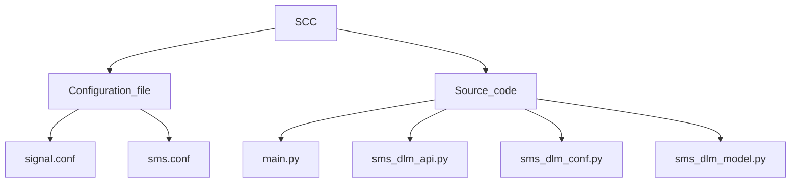

# Signal_Managing_System_Module

# [Configuration File](https://github.com/paragnema1/Siding_Control_Centre_Module/tree/main/Configuration_Files) - Files/settings that a program reads before startup.

### [signal.conf](https://github.com/paragnema1/Siding_Control_Centre_Module/blob/main/Configuration_Files/scc.conf) 
    "signal_id" : A unique identifier for each signal in the network,
    "section_marks": An array of objects containing section marks
                    ["section_mark_id":A unique identifier for the section mark.,
                    "sections":Array of Sections,
                    "sections_name":Array of Section name,
                    "sections_controlled":Array of sections controlled,
                    "signal_controlled":Array of signal controlled,
                    "next_signal_id":signal_id of next signal.]
                    
### [sms.conf](https://github.com/paragnema1/Siding_Control_Centre_Module/blob/main/Configuration_Files/section.conf) - - sms configuration file contains:-

    Comment- Description of file.
    Version - version of module.
    SSC_ID - SSC Identifier.
    Database - Object Containing database of provider, User, Password, HOST Protocol, HOST IP address, Database name
    Local MQTT Broker - Object Containing database of MQTT broker, Broker IP address, Username, Password, Port no. of the broker.
    
# [Source Code File](https://github.com/paragnema1/Siding_Control_Centre_Module/tree/main/Source_Code) - Directory containing sub-modules.
### [insert_conf.py](https://github.com/paragnema1/Siding_Control_Centre_Module/tree/main/Source_Code/Insert_Confuguration_File) - A module containing functions to convert (JSON files to Python) and (Python to JSON).
	Class SectonConfig:
	
	def read_cfg(self, file_name): function to convert JSON file to Python file.
	
	def print_cfg(self): function to convert Python file to JSON file.

### [insert_yard_conf.py](https://github.com/paragnema1/Siding_Control_Centre_Module/tree/main/Source_Code/Insert_yard_configuration) - A module containing functions to convert (JSON file to Python) and (python to JSON).
	Class SectonConfig:
	
	def read_cfg(self, file_name): function to convert JSON file to Python file.
	
	def print_cfg(self): function to convert Python file to JSON file.

### [scc_dlm_model.py](https://github.com/paragnema1/Siding_Control_Centre_Module/tree/main/Source_Code/SCC_DLM_MODEL) - Module to create tables in the database. 
	We have created tables for SectionConfigInfo, DPInfo, SectionInfo, SecionPlaybackInfo, TrainTraceInfo, YardPerformanceInfo, TorpedoPerformanceInfo, YardConfigInfo, OccUserInfo, EventInfo, PointConfig, TrailThroughInfo, TrailThroughPlayback.

### [scc_layout_model.py](https://github.com/paragnema1/Siding_Control_Centre_Module/tree/main/Source_Code/SCC_LAYOUT_MODEL) - Module to create tables in the database.
	We have created tables for LayoutSectionInfo, and LayoutSectionConnectionsInfo.

### [scc_trail_through.py](https://github.com/paragnema1/Siding_Control_Centre_Module/tree/main/Source_Code/SCC_TRAIL_THROUGH) - module to detect trail through and torpedo status.
	***Class Sec:*** - Initialised Section Variables.
	
	***Class Trailthrough:***
	**def get_point_config(self):** - function to return section_id and
	point_id from PointConfig table.
	
	**def init_trail_through_info(self):** - add records on tt_sec_obj_list ['section_id and point_id by calling get_point_config' & 'section config objects by calling scc_api.read_section_connections_info() function.
	
	**def detect_trail_through(self, section_json_data, point_obj_list):** - function to detect trail through using passed section_json_data and point_obj_list.
	
	**def find_torpedo_status(self, section_json_data):** - finding torpedo status by using objects of tt_sec_obj_list.
	
	**def construct_section_json_msg(self):** - return json_msg with key1 as "timestamp" & key2 as (object of tt_section_msg_list).

### [scc_dlm_conf.py](https://github.com/paragnema1/Siding_Control_Centre_Module/tree/main/Source_Code/SCC_DLM_CONF) - module to load data (comment, version, lmb(local mqtt broker), scc_id) from configuration files.

	***Class SccDlmConfRead:***
	**def read_cfg(self, file_name):**
 
		Convert JSON file to python file.
	
		Match this Python file with a Schema dictionary(a class object inside this Class) and validate it by 		calling the validate_cfg() function.
	
		load data (comment, version, lmb(local mqtt broker), scc_id) from python file to Class DatabaseStruct 		class objects.

	**def validate_cfg(self):** 
	
	function to check if any data (comment, version, lmb(local mqtt broker), scc_id, PROVIDER, USER, 		PASSWORD, HOST, DB_NAME) is not present, empty, or whitespace.

	***Class DatabaseStruct(NamedTuple):***
    
	    PROVIDER: str
	    
	    USER: str
	    
	    PASSWORD: str
	    
	    HOST: str
	    
	    DB_NAME: str

### [scc_dlm_api.py](https://github.com/paragnema1/Siding_Control_Centre_Module/tree/main/Source_Code/SCC_DLM_API) - Module dealing with all Database operations such as Select, Insert, Delete records.

	***class TrainEntryExitTrace():*** - initializing Train entry and exit trace objects.
	***class SectionConnections:*** - initializing Section Connection objects.
	***class Torpedo:*** - initializing Torpedo Info objects.
	
	***class SccAPI:***
	**def connect_database(self, config):** - Connect passed argument file to postgresql database.
	
	**def get_user_roles(self, username_param):** - provide user role of passed username from OccUserInfo table.
	
	**def get_dpu_id(self, section_id_param):** - provide dpu id of passed section_id from YardConfig Table.
	
	**def insert_section_info(self, data):** - insert passed data into SectionInfo Table.
	
	**def insert_section_playback_info(self, data):** - saving passed data to section_playback_table.
	
	**def read_section_playback_info(self):** -log section_id and section_status from section_playback_table.
	
	**def insert_dp_info(self, data):** - insert passed data into dp_Info Table.
	
	**def select_section_info(self):** - Return all records from SectionInfo table.
	
	**def read_section_config_info(self):** - return all records from section_config_info table.
	
	**def read_yard_config_info(self):** - Return all records from yard_config_info table.
	
	**def read_section_connections_info(self):** - Return all records from the layout Section Connection table.
	
	**def reset_train_trace_info(self):** - Reset train_trace_obj_list.
	
	**def insert_train_trace_info(self, data):** - Add train trace info into train_trace_table iff in passed data (torpedo_axle_count is 16 and direction is in) OR (torpedo axle count is 0 and direction is out or none).
	
	**def init_section_connections_info(self):** - Store data from layoutSectionConnectionInfo into section_conn_obj_list and torpedo_obj_list.
	
	**def init_train_trace_info(self):** - ADD section id's from Section_trace_for_train_list to section_id variable in train_trace_obj_list.
	
	**def update_torpedo_id(self, data):** - update torpedo id in records of section_conn_obj_list from by matching section_id in passed data.
	
	**def torpedo_info_sub_fn(self, in_client, user_data, message):** - update torpedo id in records of section_conn_obj_list by calling “update torpedo id() ” function.
	
	**def reset_section_connections_info(self):** -reset all values of section variables in section_conn_obj_list.
	
	**def torpedo_performance(self, data):** - Update data into torpedo_obj_list only iff (passed data torpedo_axle_count is >= 12) OR (passed data torpedo_axle_count is < 6 and direction is Out).
	
	**def yard_performance(self, data):** - Update yard performance data.
	
	**def insert_torpedo_loaded_entry_info(self, torpedo_id, engine_id, unloaded_entry_time, unloaded_section_id):** - add engine_id, torpedo_id, unload_entry_ts, unload_section_id in torpedo_performance table.
	
	**def update_torpedo_unloaded_exit_info(self, torpedo_id, engine_id, unloaded_exit_time, unloaded_section_id):** - Update unload_exit_time and unload_section_id in torpedo_performance table.
	
	**def insert_train_entry_info(self, torpedo_id, engine_id, entry_time):** - add engine_id, torpedo_id, entry_ts in yard_performance table.
	
	**def update_train_exit_info(self, torpedo_id, engine_id, exit_time):** - Update torpedo_id and exit_time in yard_performance table.
	
	**def update_train_unloaded_entry_info(self, torpedo_id, engine_id, unloaded_entry_time, unloaded_section_id):** - Update torpedo_id, unload_entry_ts and unload_section_id in yard_performance table.
	
	**def update_train_unloaded_exit_info(self, torpedo_id, engine_id, unloaded_exit_time, unloaded_section_id):** - update torpedo_id, unload_exit_time and unload section_id in
	yard_performance table.
	
	**def insert_event_info(self, event_ts, event_id, event_desc):** - Add event_ts, event_id and event_desc in event_table.
	
	**def insert_trail_through_info(self, tt_msg):** - add time_stamp, section_id, confirm_status into trail through table & add time stamp and passed tt_msg to section_id in trail through playback table.
	
	**def clear_trail_through(self, tt_msg):** - Making last_tt_record_inserted[tt_msg['section_id']] = False and add time stamp and passed tt_msg to section_id in trail through playback table.

	
### [main.py](https://github.com/paragnema1/Siding_Control_Centre_Module/tree/main/Source_Code/Main_File) - main module for yard configuration and section information.
	***Class Point:*** - Initialization of point variables.

 
	***Class SectonConfig:***
	
	**def read_cfg(self, file_name):** function to convert JSON file to Python file.
	
	**def print_cfg(self):** function to convert Python file to JSON file.
	
	***Class Yard:*** - Initialization of yard variables.	
	***Class Section:*** - Initialization of section variables.	
	***Class Sccserver:***
	
	**def init_section_info(self):** - Append section class object in section_obj_list & assign section id to each section.
	
	**def cwsm_section_reset_sub_fn(self, in_client, user_data, message):** - publish section reset message and update event in event info table.
	
	**def cwsm_dp_reset_sub_fn(self, in_client, user_data, message):** - Publish dp reset message and update the event in the event info table.
	
	**def check_user_roles(self, username):** - Method to get user permission by passing user name.
	
	**def section_reset_pub_fn(self, json_section_reset_msg_param):** - Publish section reset message.
	
	**def get_dp_list_of_section(self, section_id):** - Returns dp list of section by taking section id as argument.
	
	**def dp_reset_pub_fn(self, json_dp_reset_msg_param):** - Publish dp_reset message.
	
	**def fill_yard_config_info_from_db(self):** - fill yard config info in section_obj_list from from yard_config table.
	
	**def fill_section_connections_info_from_db(self):** - fill layout section connections info in section_obj_list from LayoutSectionConnectionsInfo table.
	
	**def get_section_status(self,section_id):** - get section status ( from section_obj_list) by passing section_id of that section.
	
	**def print_section_info(self):** - log section info from section_obj_list.
	
	**def construct_section_json_msg(self):** - return section_obj_list converted into json format.
	
	**def publish_section_info(self, mqtt_client, scc_api):** - Publish section_obj_list converted into json format through mqtt.
	
	**def evaluator_section_info_sub_fn(self, in_client, user_data, message):** - insert passed json message as attribute to (section info table, section playback info table and train trace info table) & publish trail through message ‘if any’.
	
	**def load_point_config(self):** - logging point configuration (point id and section id) from pointconfig table.
	
	**def point_info_sub_fn(self, in_client, user_data, message):** - loading row of passed attribute message for which its point id is equal to point id in point_obj_list.
	
	**def print_point_info(self):** - Print point info from point_obj_list.
	
	**def tt_info_sub_fn(self, in_client, user_data, message):** - insert passed attribute message in “trail_through_info table” & “trail through playback table”.
	
	**def tt_clear_sub_fn(self, in_client, user_data, message):** - Clear trail through of section_id in passed attribute message and add info in trail_through_info table of scc_dlm_api.py
